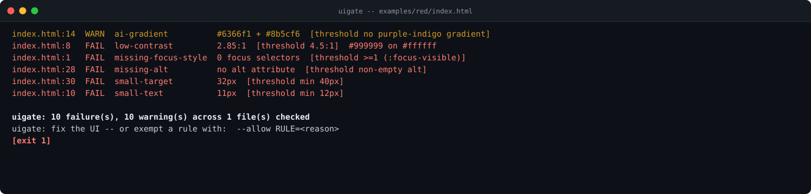

[](https://github.com/F0Rextasy/uigate/actions/workflows/test.yml)
[](https://www.python.org/)
[](#what-it-will-never-do)
[](#what-it-will-never-do)
[](https://skills.sh/F0Rextasy/uigate)
[](LICENSE)

# uigate

**Your landing page looks like every other AI landing page, and the contrast fails WCAG anyway.** The same indigo gradient, the same Inter stack, the same 12px cards with the same shadow -- plus grey-on-white body copy at 2.85:1 that no keyboard user can even tab through. `uigate` reads your local HTML/CSS as data, puts a measured number next to every finding, and fails the build when an objective defect ships.



## The problem is real

- The #1 complaint about AI-era interfaces is sameness: template
  gradients, default font stacks, and card grids make every launch
  look generated -- while real defects (contrast, focus, targets)
  hide underneath the polish.
- The niche is pre-wave, not owned: accessibility checkers need a
  browser and never flag template tells; design linters rate taste
  with vibes. Nobody has a deterministic, offline, exit-code UI gate
  that prints measured values.
- Every rule here is static parse + one arithmetic pass over bytes you
  already have: `html.parser`, regex, and the WCAG luminance formula.

## Quickstart

```bash
# install the skill into any agent (Claude Code, Codex, Cursor, OpenCode, ...):
npx skills add F0Rextasy/uigate

# or run it directly:
git clone https://github.com/F0Rextasy/uigate

# lint this repo's demo page, warnings block:
python uigate/scripts/uigate path/to/site --strict

# machine-readable report:
python uigate/scripts/uigate path/to/site --format json
```

Exit `1` = failure rule fired (or any warning with `--strict`),
`0` = clean, `2` = usage error. Python 3.8+ stdlib only, **no network
calls, ever** -- everything is parsed from local files.

## Usage patterns

| Situation | Command |
| --- |---|
| gate every PR that touches markup/styles | `uigate path/to/site --strict` |
| quick local check of one page | `uigate index.html` |
| one rule waived by policy (e.g. brand gradient) | `--allow ai-gradient=brand palette` |
| machine-readable report | `--format json` -> `counts`, `findings` |
| design review with numbers, not opinions | paste the `measured [threshold T]` column |

## Rules

Findings print `file:line  rule  measured_value  threshold` -- measured,
never vibes:

| Rule | Severity | Fires when |
| --- | --- | --- |
| `low-contrast` | fail | literal `color` vs `background` below 4.5:1 (normal) / 3:1 (large >=24px, or >=18.66px bold) -- WCAG 2.1 §1.4.3/§1.4.6 |
| `missing-focus-style` | fail | page CSS with no `:focus` selector anywhere (`:focus-visible` satisfies it) -- WCAG 2.1 §2.4.7 |
| `missing-alt` | fail | `` without `alt`, or with empty `alt` -- WCAG 2.1 §1.1.1 |
| `small-target` | fail | literal interactive size (`button`/`a`/`input`/`select`/`textarea`) below 40px -- WCAG 2.2 §2.5.8 (24px minimum, 40px practice) |
| `small-text` | fail | `font-size` below 12px |
| `ai-gradient` | warn | >=2 stops from the published purple-indigo template palette (`#6366f1 #8b5cf6 #a855f7 #d946ef #7c3aed #4f46e5`) -- heuristic |
| `system-font-only` | warn | `Inter`/`system-ui` as the only stack with no custom `@font-face` -- heuristic |
| `card-grid` | warn | >=3 identical `border-radius` **and** >=3 identical `box-shadow` -- heuristic |
| `emoji-heading` | warn | emoji inside `<h1>`/`<h2>` -- heuristic |
| `hero-boilerplate` | warn | `get started` / `unlock the power of` / `supercharge your` / `lorem ipsum` -- heuristic |
| `hardcoded-palette` | warn | >=3 literal colors with zero `var(` references -- heuristic |

```console
$ python scripts/uigate examples/red/index.html --no-color
index.html:14  WARN  ai-gradient          #6366f1 + #8b5cf6  [threshold no purple-indigo gradient]  linear-gradient(135deg, #6366f1, #8b5cf6) template gradient -- an indigo/violet linear gradient is the single most common AI-template tell -- pick a deliberate brand palette
index.html:1   WARN  card-grid            border-radius:12px x3 + box-shadow:0 4px 6px rgba(0, 0, 0, 0.1) x3  [threshold <3 identical repeats]  uniform card grid repeats one token -- vary radii/shadows/elevation instead of repeating one card token
index.html:25  WARN  emoji-heading        🚀  [threshold no emoji in headings]  <h1> 🚀 Unlock the power of Slopify -- drop the emoji from the heading -- it reads as generated filler
index.html:26  WARN  emoji-heading        ✨  [threshold no emoji in headings]  <h2> ✨ Everything you need -- drop the emoji from the heading -- it reads as generated filler
index.html:1   WARN  hardcoded-palette    18 literal colors, 0 var()  [threshold >=1 var(--*)]  palette is fully hardcoded -- move colors into custom properties so the palette is a decision, not an accident
index.html:25  WARN  hero-boilerplate     "unlock the power of"  [threshold original copy]  template copy: 🚀 Unlock the power of Slopify -- replace the template phrase with copy that says what this page does
index.html:27  WARN  hero-boilerplate     "get started"  [threshold original copy]  template copy: Get Started in seconds. Supercharge your workflow with lorem ipsum. -- replace the template phrase with copy that says what this page does
index.html:27  WARN  hero-boilerplate     "lorem ipsum"  [threshold original copy]  template copy: Get Started in seconds. Supercharge your workflow with lorem ipsum. -- replace the template phrase with copy that says what this page does
index.html:27  WARN  hero-boilerplate     "supercharge your"  [threshold original copy]  template copy: Get Started in seconds. Supercharge your workflow with lorem ipsum. -- replace the template phrase with copy that says what this page does
index.html:8   FAIL  low-contrast         2.85:1  [threshold 4.5:1]  #999999 on #ffffff -- raise the contrast (darker text, lighter background, or larger type)
index.html:15  FAIL  low-contrast         3.85:1  [threshold 4.5:1]  #eeeeee on #6366f1 -- raise the contrast (darker text, lighter background, or larger type)
index.html:21  FAIL  low-contrast         4.11:1  [threshold 4.5:1]  #777777 on #f5f5f5 -- raise the contrast (darker text, lighter background, or larger type)
index.html:28  FAIL  missing-alt          no alt attribute  [threshold non-empty alt]   without alt text -- write a non-empty alt describing the image (decorative images should be CSS backgrounds, not )
index.html:29  FAIL  missing-alt          alt=""  [threshold non-empty alt]   with empty alt text -- write a non-empty alt describing the image (decorative images should be CSS backgrounds, not )
index.html:1   FAIL  missing-focus-style  0 focus selectors  [threshold >=1 (:focus-visible)]  no :focus rule in page CSS -- add a :focus-visible rule so keyboard users can see where they are
index.html:30  FAIL  small-target         32px  [threshold min 40px]  <button> target 32px is not tappable -- grow the target to at least 40x40px so it is tappable
index.html:31  FAIL  small-target         20px  [threshold min 40px]  <a> target 20px is not tappable -- grow the target to at least 40x40px so it is tappable
index.html:10  FAIL  small-text           11px  [threshold min 12px]  font-size 11px renders below readable minimum -- grow body copy to at least 12px
index.html:20  FAIL  small-text           10px  [threshold min 12px]  font-size 10px renders below readable minimum -- grow body copy to at least 12px
index.html:1   WARN  system-font-only     Inter, system-ui, sans-serif  [threshold custom @font-face]  default Inter/system-ui stack, no font face -- ship a custom @font-face or an explicit font link instead of the default Inter/system-ui stack

uigate: 10 failure(s), 10 warning(s) across 1 file(s) checked
uigate: fix the UI -- or exempt a rule with:  --allow RULE=<reason>
[exit 1]
```

The contrast numbers are exact, not approximate: `#777777` on
`#ffffff` computes to 4.48:1 (fails 4.5:1) while `#767676` computes to
4.54:1 (passes) -- the boundary is asserted in the contract tests.
Large text honestly uses the 3:1 bar (`#777777` at 24px passes). The
clean example passes with zero findings:

```console
$ python scripts/uigate examples/clean/index.html --no-color
uigate: ok -- 0 failure(s), 0 warning(s) across 1 file(s) checked
[exit 0]
```

Machine-readable verdict:

```json
{"ok": false, "counts": {"fail": 10, "warn": 10, "exempt": 0, "files": 1}}
```

Contract tests drive the real CLI over temp pages -- exact ratios,
boundary pairs, per-rule firing, usage errors, exemptions included:

```console
$ python -m unittest discover -s tests -v
...
Ran 10 tests in 2.246s

OK
```

## Exemptions

`--allow RULE=reason` (repeatable) drops that **whole rule**, demands a
non-empty reason, and is echoed as `N exempt by --allow` in the summary
and `counts.exempt` in JSON. Unknown rules are usage errors.

## CI wiring

```yaml
- name: UI must be measurable-clean
  run: python scripts/uigate path/to/site --strict --no-color
- name: the red example must be caught
  run: |
    python scripts/uigate examples/red/index.html --no-color || test $? -eq 1
```

This repository's own [test workflow](.github/workflows/test.yml) runs
the middle step against **itself**: the committed red fixture must
exit 1, and the clean fixture must exit 0.

## What it will never do

- **Call the network.** Every finding is parsed from local bytes; same
  input, same verdict, offline.
- **Render the page or run JavaScript.** Unmeasurable values (`var()`,
  relative units, unknown colors) are skipped, never guessed -- a lint
  that vibes is not a lint.
- **Issue a taste verdict.** The contrast/alt/focus/target rules cite
  WCAG reference numbers; the tells are labeled heuristics with the
  exact token printed (`#6366f1 + #8b5cf6`, not "feels generated").

## How it compares

*Caption: A11y/design gates -- axe drives a browser at a URL; uigate reads the bytes you committed.*

|tool|install|offline?|what it measures|CI exit / key caveat|
|---|---|---|---|---|
|**uigate** (ours)|`npx skills add F0Rextasy/uigate`|Yes -- local files only|WCAG contrast math on literal colors plus disclosed AI-template tells (gradient, card grid, boilerplate)|Exit 1 on any finding over threshold; measured value printed next to every rule|
|**axe-core CLI**|`npm i -g @axe-core/cli` (v4.13.0)|No -- drives a headless browser against a URL|W3C-backed a11y rules, including color-contrast|Exits `1` on violations only with opt-in `-q`/`--exit` (default exit `0` even with findings); `file://` URLs pass through untouched -- a CI gate must pass `-q`|

## One path, many gates — the family

| Repo | What its verdict means |
| --- | ---|
| [dsh-gate](https://github.com/F0Rextasy/dsh-gate) | the shell session actually ran - real commands, real files, real log |
| [sessionaudit](https://github.com/F0Rextasy/sessionaudit) | the session behaved - scope, secrets, destructive acts, self-contradicted claims |
| [cigate](https://github.com/F0Rextasy/cigate) | the workflows burn each minute once - pins, path filters, dedup, budget |
| [ci-triage](https://github.com/F0Rextasy/ci-triage) | one log, one verdict: regression / flaky / infra / pass |
| [docproof](https://github.com/F0Rextasy/docproof) | every README doc snippet is runnable, parsed, and verified in CI |
| [preflight](https://github.com/F0Rextasy/preflight) | the config is safe to ship - semantics, not syntax |
| [prove-it](https://github.com/F0Rextasy/prove-it) | every claim in this README is backed by real, captured output |
| [shipcheck](https://github.com/F0Rextasy/shipcheck) | the artifacts in `dist/` match `src/` - nothing stale ships |
| [testgate](https://github.com/F0Rextasy/testgate) | the tests that ran are the tests that exist - gaps, dupes, skips |
| [bandaid](https://github.com/F0Rextasy/bandaid) | the diff doesn't hide a silent failure - swallowed errors, dead guards |
| [wincompat](https://github.com/F0Rextasy/wincompat) | every path in the tree survives a Windows checkout |
| [compressproof](https://github.com/F0Rextasy/compressproof) | the context shrank without losing an answer - reversible compression, byte proof, answer-equivalence oracle |
| [uigate](https://github.com/F0Rextasy/uigate) | the UI stops looking like the same AI slop - measurable design-slop lint, WCAG + template tells |
| [aitell](https://github.com/F0Rextasy/aitell) | the prose stops reading as AI - deterministic AI-tell detection with a published confusion matrix |
| [route-drift](https://github.com/F0Rextasy/route-drift) | OpenAPI spec vs code routes drift gate |

MIT licensed. New slop patterns welcome - attach the markup snippet
and the measured value it should print.
